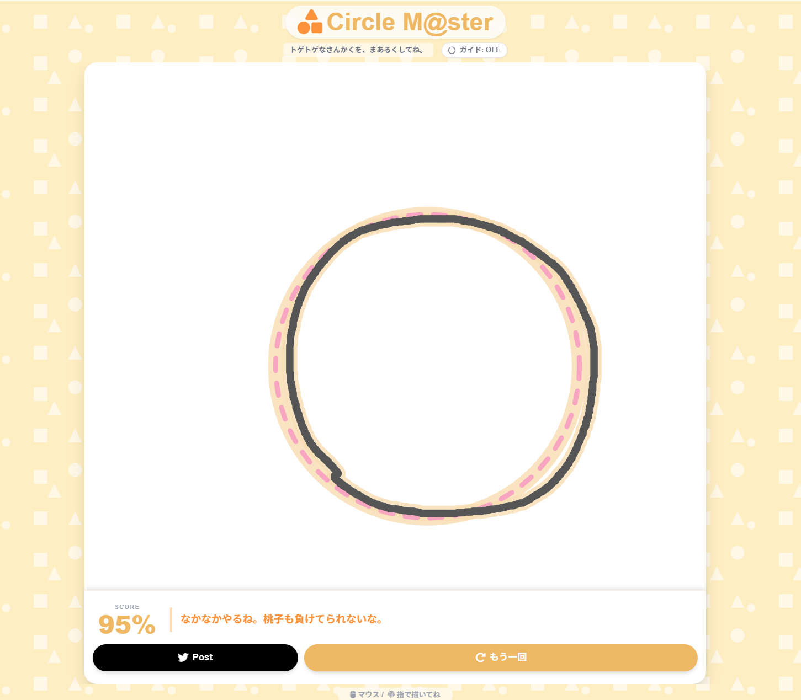

# Circle M@ster Momoko

[プレイはこちらから](https://dobby233liu.github.io/Circle-Master-Momoko/)



「トゲトゲなさんかくを、まあるくしてね。」

ブラウザで遊べる、きれいな円を描くミニゲームです。
桃子ちゃんのために、完璧な円を描いてプロデュース力を証明しましょう！

## 遊び方

- Open the [publicly hosted version](https://dobby233liu.github.io/Circle-Master-Momoko/).
- Or build the app:

    ```shell
    pnpm install
    pnpm build
    ```

    And open `dist/index.html` in a browser (HTTP server not required).

Then:

1. マウスや指を使って、画面中央にできるだけきれいな円を描きます。
2. 描いた円の「真円度」が採点され、スコアに応じて桃子ちゃんから様々なコメントがもらえます。

## 技術スタック

- HTML5 / JavaScript (Canvas API)
- Tailwind CSS
- Font Awesome
- i18next
- Vite

## 開発履歴

- 2026-01-18: プロジェクト作成、主要機能の実装
- 2026-01-20: Change page header; last update from original author
- 2026-01-30 to 02-01: Added i18n, improved canvas drawing logic, etc.
- 2026-02-22 to 23: Random cleanup and fixes; pointer support improvement;
    added favicon, Open Graph tags and manifest; started hosting this "personally"
- 2026-02-24: Added building pipeline using Vite

## ライセンス

[LICENSE](LICENSE) ファイルをご確認ください。
